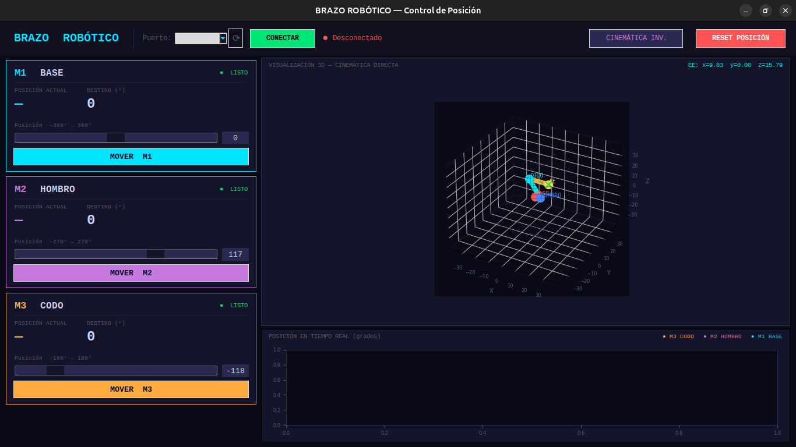

# 3DOF-Arm-Robotics-project-UMNG
Este proyecto consiste en el diseño, modelado y simulación de un brazo robótico de 3 grados de libertad (3DOF). 
Incluye el desarrollo mecánico (CAD), simulación en software, código de control y una interfaz interactiva 
para visualizar la cinemática inversa.

# 🎯 Objetivos

# Objetivo general
Diseñar y simular un brazo robótico de 3 grados de libertad capaz de posicionar su efector final mediante 
cinemática directa e inversa.

# Objetivos específicos
- Diseñar la estructura mecánica del brazo (CAD)
- Modelar matemáticamente el sistema
- Implementar la cinemática directa
- Implementar la cinemática inversa
- Crear una simulación interactiva
- Documentar el proceso de desarrollo

# 📂 Estructura del repositorio
├── Act/                     → Actas de trabajo del proyecto
├── Hardware/                → Diseños CAD del brazo robótico
├── Resources/               → Archivos auxiliares (HTML, documentación, etc.)
├── Software/Simulaciones/   → Código de simulación e interfaz en Python
├── README.md
└── LICENSE

# 🤖 Descripción del sistema

El sistema está compuesto por un brazo robótico de 3 grados de libertad:

- Articulación 1: Rotación de la base
- Articulación 2: Movimiento del primer eslabón
- Articulación 3: Movimiento del segundo eslabón
- Efector final: Posicionamiento en el plano

El modelo permite calcular:
- Cinemática directa
- Cinemática inversa
- Posición del efector final

Conexión de interfaz con el control de posicion de motores
- Conexión Serial con ESP32
- Comparación de posicion estimada y actual
- Visualizacion de pose
- Cinematica inversa y directa
- Movimiento independiente de 3 Motores

# 👩‍💻 Autores

Proyecto desarrollado por:

- Carlos Andrés Quintero Forero
- Salim Abdul Fayad Diaz
- Natalia Almanza
- Estudiantes de Ingeniería (UMNG)
