# Brazo Robótico 3DOF — Proyecto UMNG

Diseño, construcción y control de un brazo robótico de 3 grados de libertad (3-DOF) capaz de ejecutar tareas de manipulación autónoma. El proyecto abarca desde el diseño CAD y simulación hasta la implementación física completa: electrónica, firmware en ESP32, interfaz de control y planificación de trayectorias.

> **Aplicación demo:** clasificación y transporte autónomo de pelotas de ping pong entre posiciones predefinidas.

---

## Robot físico

| Vista lateral | Vista frontal (laboratorio) |
|---|---|
| 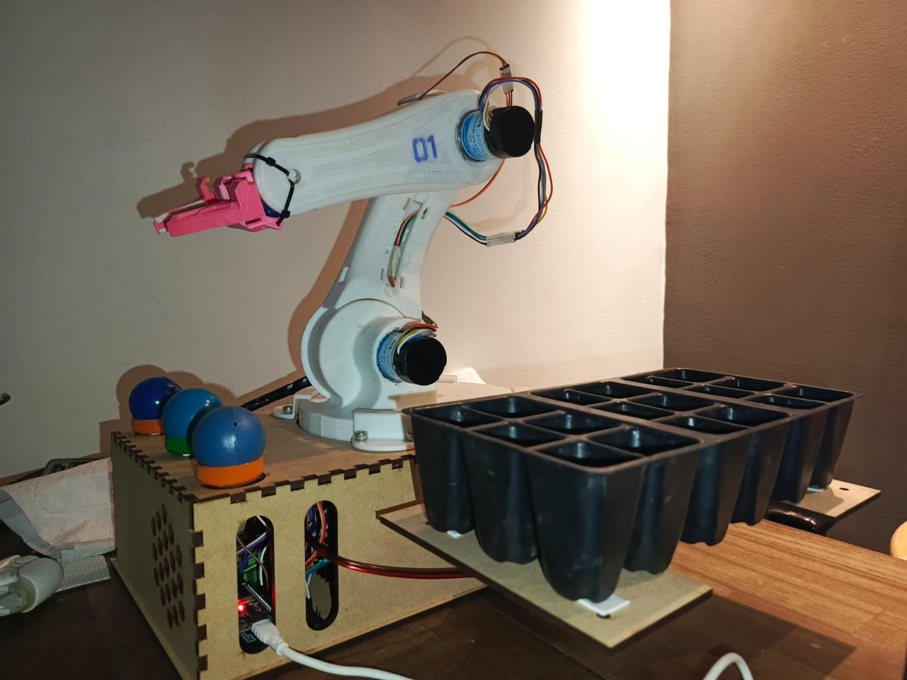 | 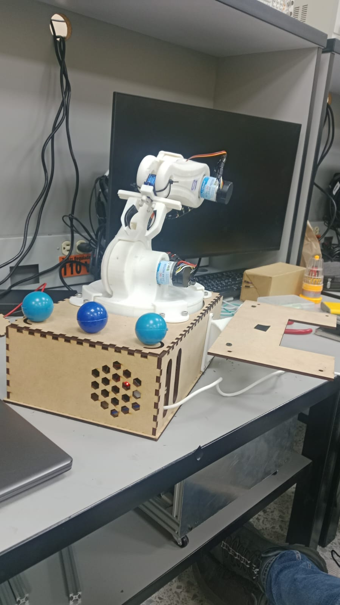 |

---

## 🎯 Objetivos

### Objetivo general
Diseñar, construir y controlar un brazo robótico de 3 DOF capaz de posicionar su efector final mediante cinemática directa e inversa, y ejecutar tareas de manipulación autónoma con trayectorias planificadas.

### Objetivos específicos
- Diseñar la estructura mecánica completa (CAD + impresión 3D + corte láser)
- Diseñar e implementar el circuito electrónico de control (PCB personalizada)
- Modelar matemáticamente el sistema (cinemática directa e inversa, Jacobiano)
- Implementar firmware en ESP32 para control de 3 motores DC con encoders
- Desarrollar una interfaz gráfica de control y monitoreo en Python
- Implementar un simulador de planificación de trayectorias
- Integrar simulación en ROS2/Gazebo con modelo URDF
- Ejecutar la tarea de clasificación de pelotas de ping pong

---

## 📂 Estructura del repositorio

```
├── Act/                          → Actas de reuniones del proyecto
├── Documentos/                   → Análisis de contexto y documentación
├── Hardware/
│   ├── CAD/                      → Diseños CAD (SolidWorks, DXF)
│   ├── PCB/                      → PCB personalizada (ESP32 + BTS7960 + 3 motores DC)
│   ├── Gripper/                  → Modelo STL del gripper
│   ├── STLs/ y STLS/             → Piezas impresas en 3D
│   └── Engranaje de Eslabon*.png → Renders de engranajes
├── Resources/
│   ├── VIDEOS/                   → Videos de pruebas y resultado final
│   ├── Trayectorias/             → CSVs de trayectorias (articular y cartesiana)
│   ├── Datos caracterizacion Motores/ → Datos encoder de los 3 motores
│   └── *.png / *.jpg             → Imágenes del proyecto
├── Software/
│   ├── brazo_integrado (4).py    → Interfaz principal de control + planificador
│   ├── abdul3dof_gui.py          → GUI de control de posición
│   ├── Gazebo/                   → Simulación en Gazebo (URDF, workspace ROS2)
│   ├── URDF/                     → Modelo URDF del brazo
│   ├── brazo_robot/              → Paquete ROS2 del robot
│   └── ws_manip/                 → Workspace de manipulación ROS2
├── README.md
└── LICENSE
```

---

## 🔧 Hardware

### Diseño mecánico (SolidWorks)

El brazo fue diseñado completamente en SolidWorks e impreso en 3D. Incluye tres eslabones, base giratoria, gripper y bandeja dispensadora de pelotas.

| Ensamblaje completo | Ensamblaje v1 |
|---|---|
| 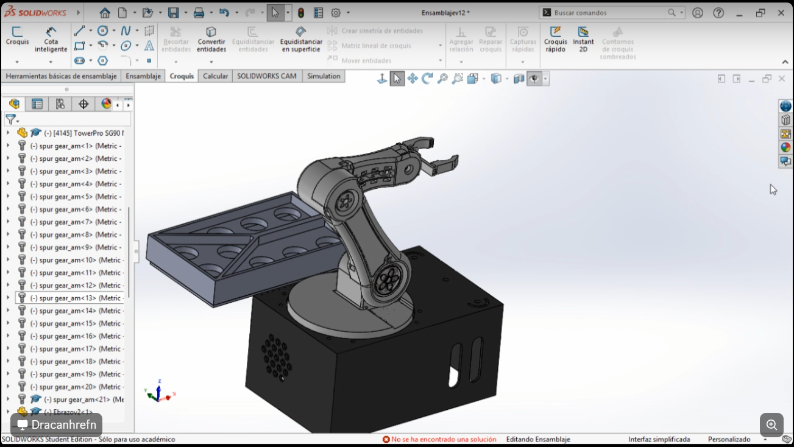 | 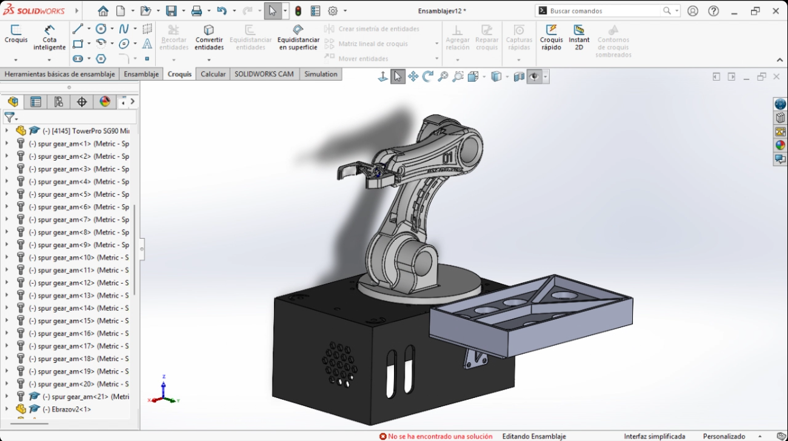 |

| Dimensiones dispensador | Bandeja ping pong (impresa) |
|---|---|
|  |  |

### Electrónica — PCB personalizada

Se diseñó e implementó una PCB a medida con:
- **ESP32** como microcontrolador principal
- **BTS7960** (×3) para control de motores DC con PWM
- Conectores de encoder para los 3 motores
- Fabricada en Bogotá (2026-04-10)

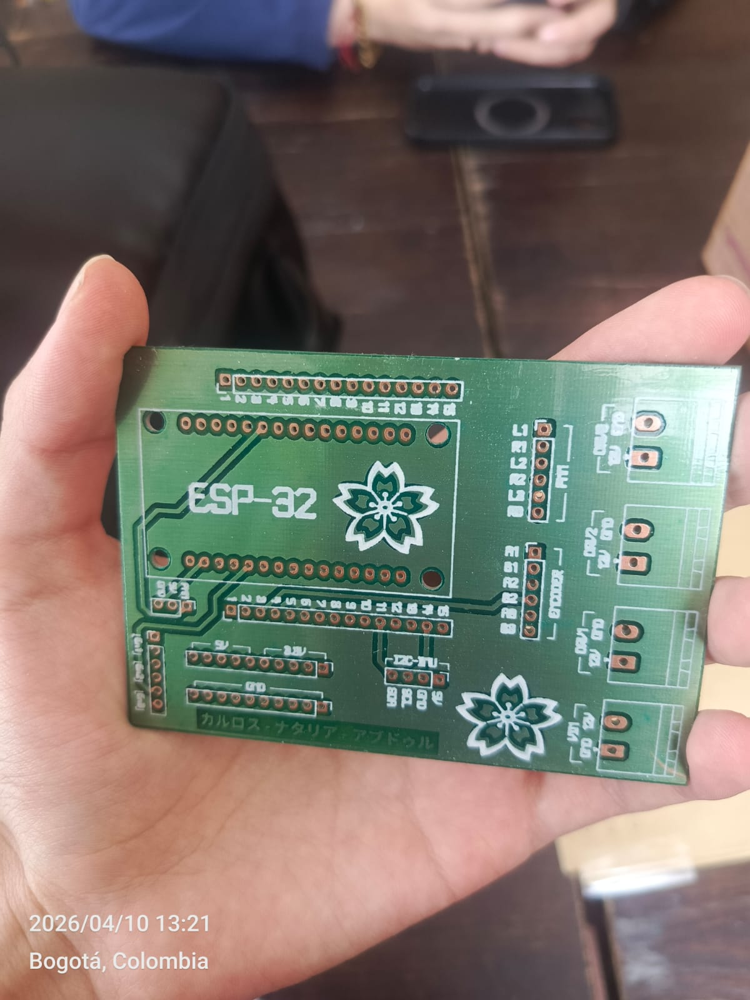

El esquemático completo está disponible en: [`Resources/Esquemático – ESP32 + BTS7960 + 3 Motores DC.pdf`](Resources/Esquemático%20–%20ESP32%20+%20BTS7960%20+%203%20Motores%20DC.pdf)

---

## 💻 Software

### Interfaz de control de posición

Interfaz gráfica en Python (`abdul3dof_gui.py`) con conexión serial al ESP32:

- Control independiente de 3 motores (M1 Base, M2 Hombro, M3 Codo)
- Visualización 3D en tiempo real de cinemática directa
- Gráfica de posición articular en tiempo real
- Cálculo y ejecución de cinemática inversa
- Reset de posición con un clic

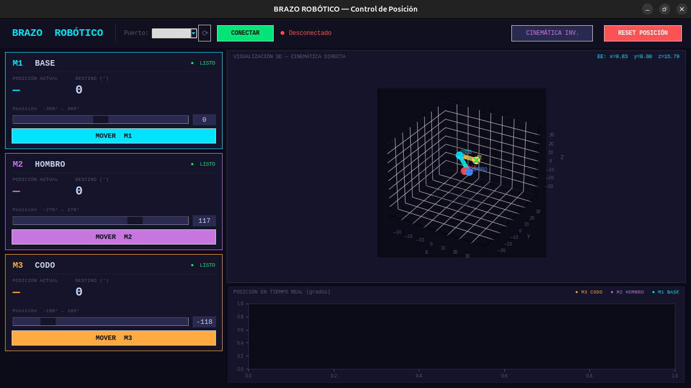

### Simulador de planificación de trayectorias

El simulador integrado (`brazo_integrado (4).py`) permite planificar y animar trayectorias completas:

- Editor de waypoints (XYZ o articular)
- 3 modos de interpolación: **articular (curva)**, **cartesiana (recta)**, **control cinemático (Jacobiano)**
- Visualización 3D animada de la trayectoria del efector final
- Gráficas: posición articular, velocidad, aceleración y posición XYZ del EE
- Importación de trayectorias desde CSV
- Gripper integrado en la simulación
- Resumen automático: waypoints, tramos, tiempo total

| Planificador de trayectorias (ping pong articular) | Ángulos enviados / control real |
|---|---|
| 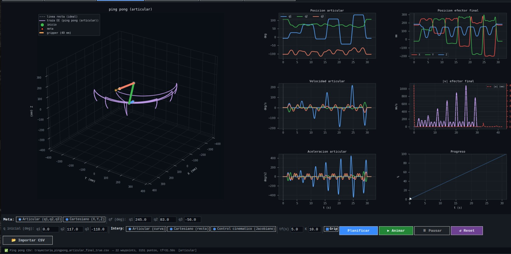 | 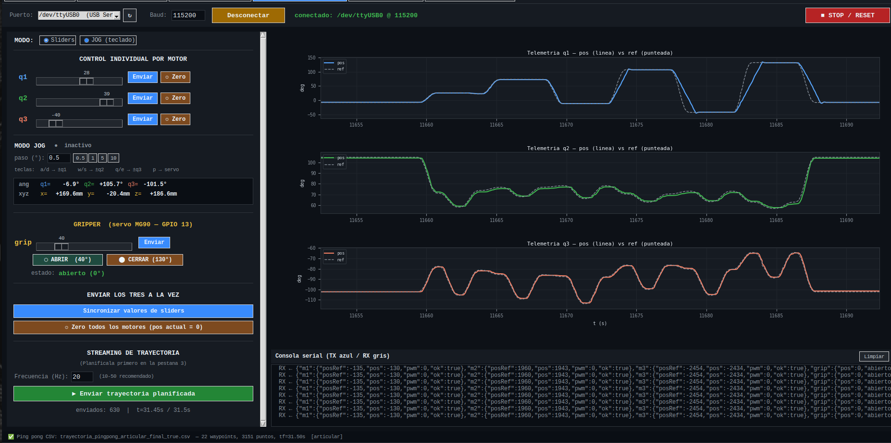 |

**Trayectoria ping pong:** 22 waypoints, 21 tramos, tiempo total ≈ 31.5 s, gripper 40 mm de apertura.

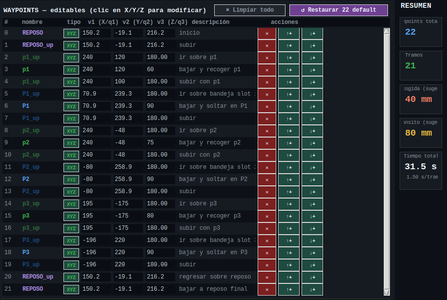

### Simulación ROS2 / Gazebo

Simulación completa con modelo URDF en Gazebo y visualización en RViz:

| RViz — modelo 3D | Gazebo + interfaz Python |
|---|---|
| 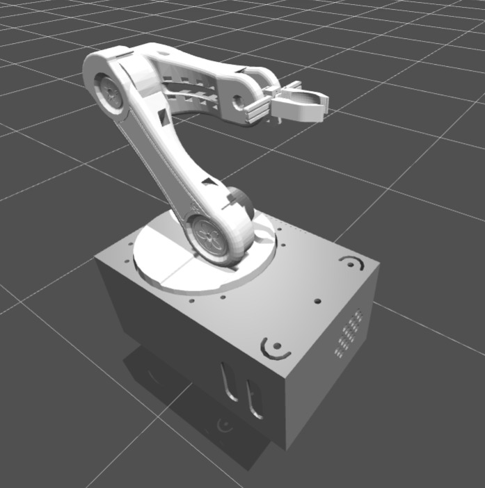 | 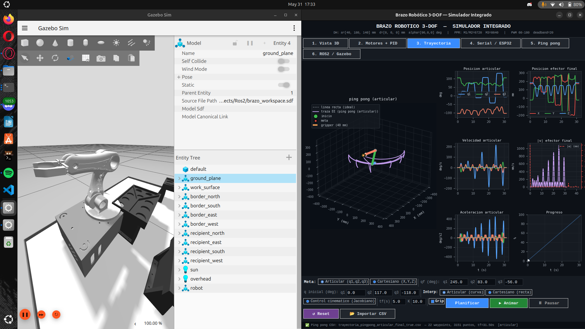 |

### Cinemática inversa interactiva

Archivo HTML autocontenido (`Resources/cinematica_inversa_interactiva.html`) para explorar visualmente la cinemática inversa del brazo en el navegador, sin instalación adicional.

---

## 🏓 Aplicación: clasificación de pelotas de ping pong

El robot ejecuta una secuencia autónoma de pick & place: recoge pelotas del dispensador y las deposita en posiciones predefinidas de una bandeja receptora.

- **Dispensador:** bandeja 3D-impresa con ranuras para pelotas de colores
- **Gripper:** pinza impresa en 3D (apertura 40 mm)
- **Trayectoria:** planificada con el simulador y cargada via CSV al firmware
- **Ejecución:** ~31.5 s por ciclo completo (3 pelotas)

**Video — prueba final:**

<<<<<<< HEAD
<video src="https://raw.githubusercontent.com/Arlo-qexe/3DOF-Arm-Robotics-project-UMNG/main/Resources/VIDEOS/video_final.mp4" controls width="720"></video>
=======
<video src="https://github.com/Arlo-qexe/3DOF-Arm-Robotics-project-UMNG/blob/main/Resources/VIDEOS/video_final.mp4" controls width="720"></video>
>>>>>>> origin/main

Más videos de prueba en [`Resources/VIDEOS/`](Resources/VIDEOS/)

---

## 📊 Caracterización de motores

Se midieron y registraron curvas de velocidad y posición (encoder) para los 3 motores bajo distintas condiciones:

```
Resources/Datos caracterizacion Motores/
├── M1_Encoder_data_210.csv
├── M2_Encoder_data_rads_210.csv
├── M3_Encoder_data_rads_270.csv
└── ...
```

---

## 👩‍💻 Autores

Proyecto desarrollado por estudiantes de Ingeniería — **Universidad Militar Nueva Granada (UMNG)**:

- **Carlos Andrés Quintero Forero**
- **Salim Abdul Fayad Diaz**
- **Natalia Almanza**
